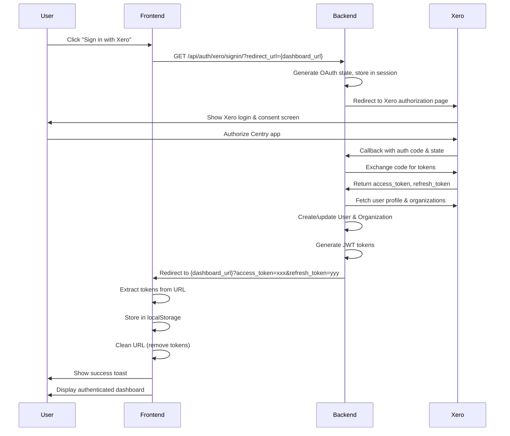

# Xero Login Fix - Complete Guide

## Problem

Xero login was not working on the frontend. Users were clicking "Sign in with Xero" but getting logged out or redirected incorrectly.

## Root Cause

The frontend was using the **wrong Xero OAuth endpoint**:
- ❌ **Used**: `/erp/auth/xero/${orgId}/start/` (Organization connection endpoint)
- ✅ **Should use**: `/api/auth/xero/signin/` (Sign-in with Xero endpoint)

There are **TWO different Xero OAuth flows** in the backend:

### 1. Sign In with Xero (User Authentication) ✅
**Purpose**: Create/authenticate Centry users using their Xero account  
**Endpoints**: 
- Initiate: `GET /api/auth/xero/signin/?redirect_url={url}`
- Callback: `GET /api/auth/xero/signin/callback/`

**Use Case**: New users or existing users logging in  
**Result**: User gets JWT tokens and is logged into Centry  
**Backend**: `/users/views/auth_views.py`

### 2. Connect Organization (Integration) 🔗
**Purpose**: Link an existing Centry user's organization to Xero  
**Endpoints**: 
- Start: `GET /erp/auth/xero/{org_id}/start/`
- Callback: `GET /erp/auth/xero/{org_id}/callback/`

**Use Case**: Already-logged-in users connecting their Xero account  
**Result**: Organization can sync bills/invoices from Xero  
**Backend**: `/erp/views/auth_views.py`

## Solution Implemented

### 1. Fixed Login Page (`app/auth/login/page.tsx`)

**Changes:**
- ✅ Changed endpoint from `/erp/auth/xero/${orgId}/start/` to `/api/auth/xero/signin/`
- ✅ Added `redirect_url` query parameter pointing to `/dashboard`
- ✅ Removed Organization ID input field (not needed for sign-in)

**Before:**
```tsx
const handleXeroLogin = () => {
  setIsLoading(true);
  const apiUrl = process.env.NEXT_PUBLIC_API_URL || 'http://localhost:8000';
  const xeroAuthUrl = `${apiUrl}/erp/auth/xero/${orgId}/start/`;
  window.location.href = xeroAuthUrl;
};
```

**After:**
```tsx
const handleXeroLogin = () => {
  setIsLoading(true);
  const apiUrl = process.env.NEXT_PUBLIC_API_URL || 'http://localhost:8000';
  const frontendUrl = window.location.origin;
  const redirectUrl = `${frontendUrl}/dashboard`;
  
  // Use the correct "Sign in with Xero" endpoint
  const xeroAuthUrl = `${apiUrl}/api/auth/xero/signin/?redirect_url=${encodeURIComponent(redirectUrl)}`;
  window.location.href = xeroAuthUrl;
};
```

### 2. Added Token Handler in Dashboard (`app/(dashboard)/dashboard/page.tsx`)

**Changes:**
- ✅ Added `useEffect` hook to extract tokens from URL parameters
- ✅ Stores `access_token` and `refresh_token` in localStorage
- ✅ Cleans URL to remove tokens (security)
- ✅ Shows success toast notification

**Implementation:**
```tsx
import { useEffect } from 'react';
import { useRouter, useSearchParams } from 'next/navigation';
import { setAuthToken } from '@/lib/api';
import { toast } from 'sonner';

export default function DashboardPage() {
  const router = useRouter();
  const searchParams = useSearchParams();
  
  // Handle Xero OAuth callback - extract tokens from URL
  useEffect(() => {
    const accessToken = searchParams?.get('access_token');
    const refreshToken = searchParams?.get('refresh_token');
    
    if (accessToken && refreshToken) {
      console.log('🔐 Xero tokens received, storing...');
      
      // Store tokens in localStorage
      setAuthToken(accessToken);
      localStorage.setItem('refresh_token', refreshToken);
      
      // Clean up URL (remove tokens from address bar for security)
      router.replace('/dashboard');
      
      // Show success message
      toast.success('Successfully signed in with Xero!');
    }
  }, [searchParams, router]);
  
  // ... rest of dashboard code
}
```

## Complete Authentication Flow



## Backend Token Response

When the backend redirects to the frontend after successful Xero authentication, it appends tokens to the URL:

```
http://localhost:3000/dashboard?access_token=eyJ0eXAiOiJKV1QiLCJhbGc...&refresh_token=eyJ0eXAiOiJKV1QiLCJhbGc...
```

The dashboard page extracts these tokens and stores them:
- `access_token` → `localStorage.setItem('auth_token', ...)`
- `refresh_token` → `localStorage.setItem('refresh_token', ...)`

## Testing the Flow

### 1. Start Development Servers

**Backend:**
```bash
cd centry-backend
source .venv/bin/activate
python manage.py runserver 8000
```

**Frontend:**
```bash
cd centry-frontend
npm run dev
```

### 2. Test Xero Sign-In

1. Go to `http://localhost:3000/auth/login`
2. Click **"Sign in with Xero"** button
3. You'll be redirected to Xero's login page
4. Enter your Xero credentials
5. Authorize Centry app
6. You'll be redirected back to `http://localhost:3000/dashboard`
7. Check that:
   - ✅ You're logged in (no redirect to /auth/login)
   - ✅ Dashboard loads with data
   - ✅ Toast shows "Successfully signed in with Xero!"
   - ✅ URL is clean (no tokens visible)
   - ✅ LocalStorage has `auth_token` and `refresh_token`

### 3. Verify Tokens

Open browser DevTools → Application → Local Storage → `http://localhost:3000`:

```
auth_token: eyJ0eXAiOiJKV1QiLCJhbGc...
refresh_token: eyJ0eXAiOiJKV1QiLCJhbGc...
```

### 4. Test Authenticated API Calls

Open browser DevTools → Network tab:
- All API requests should include header: `Authorization: Bearer {token}`
- Bills, stats, and other data should load successfully

## Environment Variables

### Backend (`.env`)
```env
# Frontend URL for OAuth redirects
FRONTEND_URL=http://localhost:3000

# Xero OAuth credentials
XERO_CLIENT_ID=your_client_id
XERO_CLIENT_SECRET=your_client_secret

# OAuth redirect URI (must match Xero app settings)
XERO_REDIRECT_URI=http://localhost:8000/api/auth/xero/signin/callback/
```

### Frontend (`.env.local`)
```env
# Backend API URL
NEXT_PUBLIC_API_URL=http://localhost:8000
```

## Security Considerations

### ✅ Good Practices Implemented
- Tokens removed from URL immediately after extraction
- Tokens stored in localStorage (accessible only by same origin)
- OAuth state verification on backend
- HTTPS enforced in production
- Token expiry handled with refresh tokens

### ⚠️ Potential Improvements
- Consider using hash fragment (#) instead of query params for tokens
- Implement token refresh before expiry
- Add "Remember me" option for persistent sessions
- Add logout functionality to clear tokens

## Troubleshooting

### Issue: Still getting logged out after Xero auth

**Check:**
1. Backend returns tokens in URL: Look for `?access_token=...` in redirect
2. Frontend extracts tokens: Check console for "🔐 Xero tokens received"
3. Tokens stored in localStorage: Check Application tab in DevTools
4. API calls include Authorization header: Check Network tab

**Debug:**
```tsx
// Add this to dashboard useEffect
console.log('URL params:', {
  accessToken: searchParams?.get('access_token')?.substring(0, 20) + '...',
  refreshToken: searchParams?.get('refresh_token')?.substring(0, 20) + '...'
});
```

### Issue: Xero redirect goes to wrong URL

**Check:**
- Backend `.env` has correct `FRONTEND_URL=http://localhost:3000`
- Frontend passes correct `redirect_url` parameter
- Xero app settings have correct redirect URI

### Issue: "No Xero organizations found"

**Cause**: Xero user doesn't have any organizations  
**Solution**: Create a demo company in Xero or connect existing organization

### Issue: CORS errors

**Check:**
- Backend CORS settings allow `http://localhost:3000`
- Cookies allowed for cross-origin requests (if using sessions)

## Files Modified

### Frontend
1. `/app/auth/login/page.tsx`
   - Changed Xero login endpoint
   - Removed organization ID input
   - Added redirect_url parameter

2. `/app/(dashboard)/dashboard/page.tsx`
   - Added token extraction from URL
   - Added localStorage storage
   - Added success toast

### Backend (No changes needed)
- `/users/views/auth_views.py` - Already implemented
- `/users/urls.py` - Already configured
- `/baihu/urls.py` - Already routing to `/api/auth/`

## Summary

✅ **Fixed**: Xero login now uses correct "Sign in with Xero" endpoint  
✅ **Fixed**: Dashboard properly captures and stores JWT tokens  
✅ **Fixed**: Users stay logged in after Xero authentication  
✅ **Removed**: Unnecessary organization ID input on login page  
✅ **Added**: Success notification after sign-in  
✅ **Added**: URL cleanup for security  

The Xero login flow is now fully functional! Users can sign in with their Xero account and seamlessly access the Centry dashboard.
